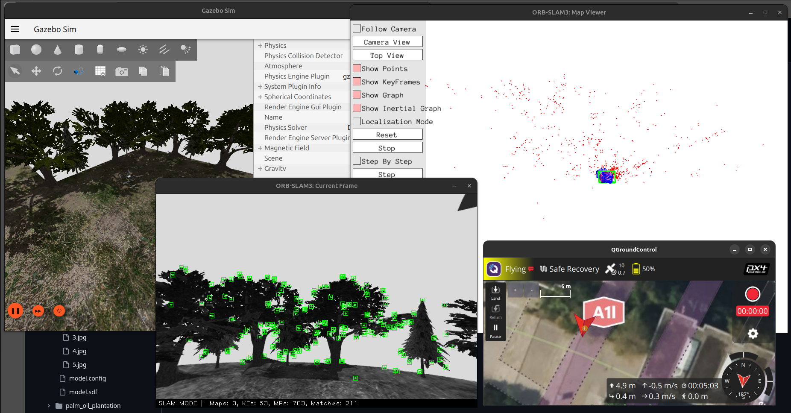
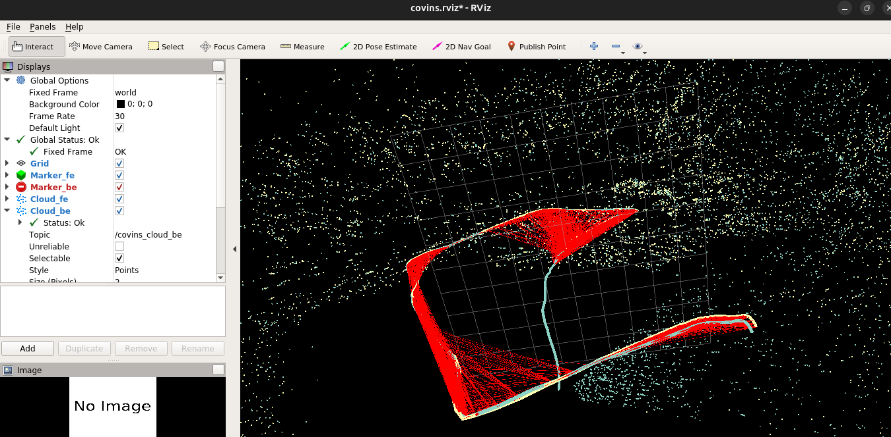

# Multi-Drone SLAM Integration (WIP)

<p align="center">
  
  
  
</p>

Integration of **ORB-SLAM3 + COVINS + PX4 + Gazebo + ROS 2** for collaborative localization and mapping with multiple `x500_depth` drones in Gazebo Forest world.

Current status:
- Per-agent RGB-D SLAM with `orb_slam3_ros2_wrapper`.
- Multi-agent CSLAM with COVINS (backend running in ROS 1 Docker).
- Trajectories and global map visible in RViz (COVINS backend).
- Per-agent dense cloud generation with `orb_slam3_map_generator` (still unstable).
- PX4 `offboard_control` node available (autonomous exploration still under development).


## Architecture Summary

1. **Simulation**: PX4 SITL (multiple instances) in Gazebo.
2. **Gazebo -> ROS 2 Bridge**: `ros_gz_bridge` publishes per-drone RGB-D streams.
3. **SLAM Frontend**: `orb_slam3_ros2_wrapper` processes RGB-D per agent.
4. **CSLAM Backend**: COVINS in ROS 1 Docker receives keyframes/landmarks.
5. **Visualization**: RViz in Docker shows trajectories, global map, and loop closures.
6. **Control**: `px4_ros_com` provides offboard control while SLAM is running.

## Repository Structure

- `multi_slam`: custom integration package (launch files, bridge config, static TFs).
- `orb_slam3_ros2_wrapper`: ROS 2 ORB-SLAM3 wrapper with COVINS/multi-agent changes.
- `orb_slam3_map_generator`: dense cloud generation from local map data.
- `covins`: CSLAM backend (ROS 1) with adjustments for this workflow.
- `px4_ros_com`, `px4_msgs`, `ORB_SLAM3`, `slam_msgs`, etc.: third-party dependencies used by this integration.

Licenses and attributions: see [THIRD_PARTY_NOTICES.md](THIRD_PARTY_NOTICES.md).

## Current Runtime Workflow

### 0) Setup (ROS 2 host)

```bash
cd ~/ws_offboard_control
colcon build
source install/setup.bash
export ROS_DOMAIN_ID=55
```

### 1) COVINS Backend (ROS Melodic Docker)

Build the Docker image from this repository using `covins/docker` (including your local modifications):

```bash
cd ~/ws_offboard_control/src/covins/docker
make build NR_JOBS=8
```

Then run inside the container:

```bash
roscore
rosrun covins_backend covins_backend_node
```

You can also use `covins/docker/run.sh` to launch roscore/backend.

### 2) PX4 + Gazebo Simulation (2 drones)

Terminal 1:
```bash
cd ~/PX4-Autopilot
source venv/px4/bin/activate
PX4_SYS_AUTOSTART=4001 PX4_SIM_MODEL=gz_x500_depth ./build/px4_sitl_default/bin/px4 -i 1
```

Terminal 2:
```bash
cd ~/PX4-Autopilot
source venv/px4/bin/activate
PX4_GZ_STANDALONE=1 PX4_SYS_AUTOSTART=4001 PX4_GZ_MODEL_POSE="0,1" PX4_SIM_MODEL=gz_x500_depth ./build/px4_sitl_default/bin/px4 -i 2
```

### 3) Micro XRCE Agent (optional at current stage)

```bash
MicroXRCEAgent udp4 -p 8888
```

### 4) Gazebo -> ROS 2 Bridge

```bash
cd ~/ws_offboard_control
source install/setup.bash
ros2 run ros_gz_bridge parameter_bridge --ros-args \
  -p config_file:=/home/carlos/ws_offboard_control/src/multi_slam/config/gz_bridge.yaml \
  -p use_sim_time:=true
```

Important: update `multi_slam/config/gz_bridge.yaml` so topic names match your active agent namespaces.

### 5) ORB-SLAM3 Frontend per agent

Agent 0 (automatic namespace `uav_1`):
```bash
ros2 launch orb_slam3_ros2_wrapper rgbd.launch.py ag_n:=0
```

Agent 1 (automatic namespace `uav_2`):
```bash
ros2 launch orb_slam3_ros2_wrapper rgbd.launch.py ag_n:=1
```

The launch file uses `ag_n` to build namespaces (`ag_n=0 -> uav_1`, `ag_n=1 -> uav_2`) and subscribes per agent to:
- `/uav_X/rgb/image_raw`
- `/uav_X/depth/image`

### 6) COVINS Visualization (inside Docker)

Once the backend receives enough keyframes (controlled by `comm.start_sending_after_kf` in `covins/covins_comm/config/config_comm.yaml`), run:

```bash
rviz -d ~/covins_ws/src/covins/covins_backend/config/covins.rviz
```

### 7) Local one-agent bringup (shortcut)

If Gazebo and PX4 are already running:

```bash
ros2 launch multi_slam bringup.launch.py robot_namespace:=uav_1
```

This bringup launches bridge, `ros1_bridge`, static frames, and ORB-SLAM3 RGB-D.

### 8) Offboard control (exploration algorithm not integrated yet)

```bash
cd ~/ws_offboard_control
source install/setup.bash
ros2 run px4_ros_com offboard_control
```

## Project Status

Completed:
- ORB-SLAM3 RGB-D integration with PX4 drone camera data in Gazebo.
- COVINS backend integration (ROS 1 Docker) with ROS 2 frontend.
- Multi-agent support in wrapper launch files.
- Global map and per-agent trajectory visualization.

In progress:
- Bridging COVINS pose/TF from ROS 1 to ROS 2 per agent.
- Improving dense cloud robustness in `orb_slam3_map_generator`.
- 2D projection/occupancy representation and a simple multi-drone exploration algorithm.

## Base References

- ORB-SLAM3: https://github.com/UZ-SLAMLab/ORB_SLAM3
- COVINS: https://github.com/VIS4ROB-lab/covins
- PX4 ROS 2 (`px4_ros_com`, `px4_msgs`): https://github.com/PX4

This repository primarily documents the **system integration and adaptations** for a multi-drone scenario.
